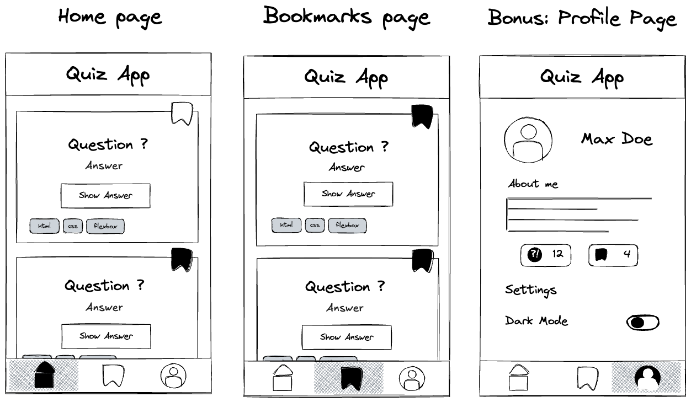
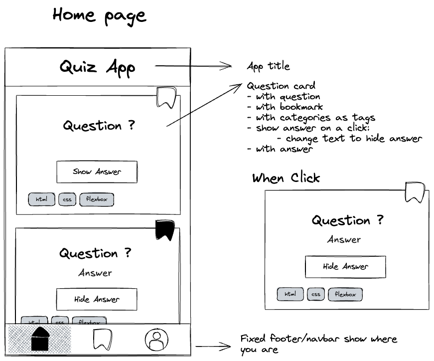
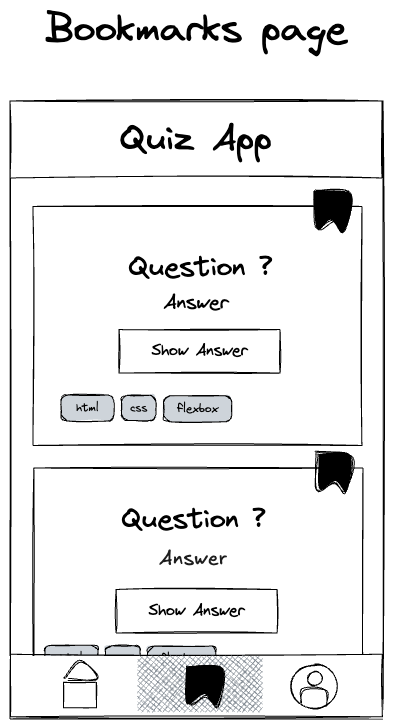
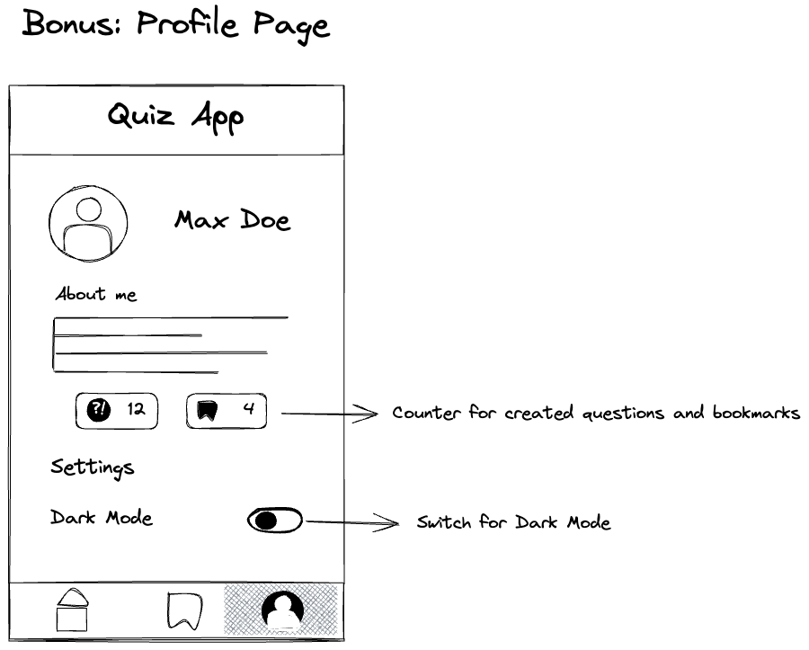

# Recap Projekt 1: Quiz App – Layout

In diesem Projekt erstellst du das Layout deiner ersten mobilen Webanwendung, einer Quiz App. In späteren Projekten werden wir diese App erweitern und alle möglichen coolen Funktionalitäten hinzufügen.

## Überblick

In diesem Projekt werden wir 3 Seiten haben:

- **Home-Seite:** Hier kannst du alle auf der Plattform verfügbaren Fragen ansehen.
- **Bookmarks-Seite:** Dies ist ein eigener Bereich, in dem du ausschließlich die von dir mit einem Lesezeichen versehenen Fragen sehen kannst, ähnlich denen, die auf der Home-Seite markiert sind.
- **Profil-Seite:** In diesem Bereich kannst du dein Profil und deine Einstellungen ansehen und verwalten.

Nutze diese [Themenideen](assets/wireframes/topics.md) für deine Quiz App oder wähle eigene Themen, vermeide aber Platzhaltertexte.



## Setup

Um zu beginnen, führe die folgenden Aufgaben aus:

- Erstelle einen neuen Ordner für dein Projekt innerhalb von `web-bootcamp`.
- Initialisiere ein lokales Git-Repository.
- Erstelle eine `.gitignore`-Datei und füge `.DS_Store` und `.vscode` hinzu.
- Erstelle ein Remote-Repository und verbinde es mit deinem lokalen Repository.
- Erstelle die Dateien `index.html` und `styles.css`.
- Stelle sicher, dass die CSS-Datei im HTML-Dokument eingebunden ist.

## Ressourcen

Lade die benötigten Icons herunter: [Lucide](https://lucide.dev/icons/) oder [Flaticon](https://www.flaticon.com/), und speichere sie in einem Ordner namens `assets` im Hauptverzeichnis deiner App.

## Deployment deines Projekts

🚀 Das Deployment des Projekts zu **GitHub Pages** ist erforderlich: Bitte halte dich an die [Deployment-Richtlinien](https://web-bootcamp-docs.neuefische.de/deployment) für detaillierte Anweisungen.

## Aufgaben

### 1. Home-Seite

Wie du bereits aus früheren Aufgaben weißt, wollen wir als Entwickler:innen immer ein Feature fertigstellen und in den `main`-Branch bringen, anstatt drei verschiedene Features anzufangen, von denen keines funktioniert. Deshalb ist der erste Schritt zum Erfolg, mit der Home-Seite zu beginnen.

Erstelle folgendes Layout:



- Starte mit dem Feature „Titel“ auf einem neuen Feature-Branch und erstelle den App-Titel.
- Wenn du fertig bist, verwende den Feature-Branch-Workflow, um deine Ergebnisse in den `main`-Branch zu mergen.
- Fahre auf die gleiche Weise mit „question-card“ und „navbar“ fort.
- Stelle sicher, dass der Bereich, der die Fragekarten enthält, scrollbar ist.

💡 Hinweis: Verwende Anker-Elemente (`<a>`) für die Navbar, damit du später zu den anderen Seiten verlinken kannst.  
💡 Hinweis: Du kannst andere Teilnehmende bitten, deine Pull Requests zu reviewen. Dadurch lernst und verbesserst du dich sehr.

❗️ Du musst dir noch keine Gedanken darüber machen, wie Antworten oder Bookmarks getoggelt werden, daran arbeiten wir in einem späteren Projekt. Stelle aber sicher, dass du Antworttexte und Bookmark-Buttons in deiner App einbaust. (Du möchtest vielleicht das `hidden`-Attribut nachschlagen.)

### 2. Bookmarks-Seite



Die zweite Seite ist die Bookmarks-Seite.

- Erstelle eine neue Datei namens `bookmarks.html`.
- Füge der Seite Inhalte hinzu. Du kannst Inhalte aus der `index.html` kopieren, um Zeit zu sparen.
- Stelle sicher, dass auf dieser Seite nur Fragen angezeigt werden, die mit einem Bookmark versehen sind.
- Aktualisiere die Navbar so, dass das Bookmark-Icon hervorgehoben ist.
- Verlinke die beiden Seiten über die Anker-Elemente (auch auf der Home-Seite).

## Bonus

### Profil-Seite



Erstelle die Profil-Seite auf dieselbe Weise, wie du die anderen beiden Seiten erstellt hast.

- Erstelle eine neue Datei `profile.html`.
- Füge der Seite Inhalte hinzu.
- Verlinke die Seiten über die Anker-Elemente.

💡 Der Zähler und der Schalter (Switch) müssen jetzt noch nicht funktionieren, das implementieren wir später.

## Empfehlungen

### Semantische Elemente und Barrierefreiheit

- Stelle sicher, dass überall, wo es möglich ist, semantisches HTML verwendet wird.
- Überprüfe, ob alle interaktiven Elemente einen zugänglichen Namen haben. Ein Icon, das klickbar ist, kann z. B. trotzdem keinen zugänglichen Namen haben.
- Stelle sicher, dass jede Seite genau ein `<h1>`-Element enthält und dass keine Überschriftsebene übersprungen wird.
- Achte darauf, dass der Textinhalt deiner interaktiven Elemente klar und aussagekräftig ist.

### Quiz-App-CSS in verschiedene Dateien aufteilen

- Der Dateiname sollte zum Namen der Komponente passen.
- Verschiebe alle Styles, die in mehreren Komponenten verwendet werden, in eine `global.css`-Datei.  
  Deine Haupt-CSS-Datei (z. B. `styles.css`) sollte mehrere `@import`-Anweisungen enthalten.
- Die Dateistruktur könnte zum Beispiel so aussehen:

```
quiz-app
├── components
│   ├── button.css
│   ├── card.css
│   ├── header.css
│   └── navigation.css
├── global.css
├── styles.css
├── profile.html
├── bookmarks.html
└── index.html
```

❗️ Achte darauf, dass du die **BEM-Methode** auf deine Quiz App anwendest (bringe mehr Struktur in deinen Code, indem du alle Klassen nach BEM benennst!).


# Recap Project 1: Quiz App - Layout

In this project you will build the layout of your first mobile web application, a quiz app. In later
projects we will expand this app and add all sorts of cool functionality.

## Overview

In this project we will have 3 pages:

- **Home page:** Here, you’ll have access to view all questions available on the platform.
- **Bookmark page:** This is a dedicated space where you can exclusively view the questions you’ve bookmarked, similar to the ones marked on the home page.
- **Profile page:** This section allows you to view and manage your profile and settings.

Explore [these topic](assets/wireframes/topics.md) ideas for your quiz app or choose your own, avoiding placeholder text.


## Setup

To begin, perform the following tasks:

- Create a new folder for your project insinde `web-bootcamp`.
- Initialize a local git repository.
- Create a `.gitignore` file and add `.DS_Store` and `.vscode` to the file.
- Create a remote repository and connect it to the local repository.
- Create the `index.html` and `styles.css` files.
- Ensure that the CSS file is loaded in the HTML document.

## Resources

Download the required Icon: [Lucide](https://lucide.dev/icons/) or [Flaticon](https://www.flaticon.com/), and save them in an "assets" folder within your app's main directory.

## Deploying Your Project

🚀 Project Deployment to **GitHub Pages** is required: Please adhere to the [deployment guidelines](https://web-bootcamp-docs.neuefische.de/deployment) for detailed instructions.

## Tasks

### 1. Home Page

As you already know from previous challenges, as developers we want to always finish a feature and
add it to our main branch, instead of starting 3 different features and none of them work. This is
why the first step to success is to start with the homepage.

- Create the following layout:


- Start with the feature 'title' on a fresh feature branch and create the app title.

- When done, use the feature branch workflow to merge your results into the main branch.
- Continue in the same way with the 'question-card' and 'navbar'.
- Ensure the area containing the question cards is scrollable.

> 💡 Hint: Make sure to use anchor elements for the navbar, so you can link to the other pages later
> on!

> 💡 Hint: You can ask fellow students to review your PRs. You will learn and improve a
> lot by doing so.

❗️ You don't have to worry about how to toggle answers or bookmarks, we will work on that in a
later project. But make sure you include the answer texts and bookmark buttons in your app. (You
might want to look up the "hidden" attribute.)

### 2. Bookmarks Page


The second page is the bookmarks page.

- Create a new file called `bookmarks.html`.
- Add content to the page. You can copy content of the `index.html` to save time.
- Make sure that only bookmarked questions are on this page.
- Update the navbar so that the bookmark icon is highlighted.
- Link the two pages via the anchor elements. (Also on the homepage).

## Bonus

### Profile Page


Create the profile page in the same way you created the other two pages.

- Create a new file `profile.html`.
- Add content to the page.
- Link the pages via the anchor elements.

> 💡 The counter and switch don't have to work for now, we will implement this later.

## Recommendations

### Semantic Element and Accessibility

- Ensure that semantic HTML is used wherever possible.
- Verify that all interactive elements have an accessible name. For instance, an icon that the user can click might still lack an accessible name.
- Make sure each page includes a single `<h1>` element, and that heading levels are not skipped.
- Check that the text content of your interactive elements is clear and descriptive.

### Separate the Quiz App CSS code into different files

The file name should match the name of the
component.

Move all styles that are used across multiple components to a `global.css` file. Your main CSS file (e.g. `styles.css`) should have several `@import` statements.

The file structure might look something like this:

```
quiz-app
├── components
│   ├── button.css
│   ├── card.css
│   ├── header.css
│   └── navigation.css
├── global.css
├── styles.css
├── profile.html
├── bookmarks.html
└── index.html
```

❗️ Make sure you apply the BEM method to your Quiz App (bring more structure to your code by using BEM to name all classes!).