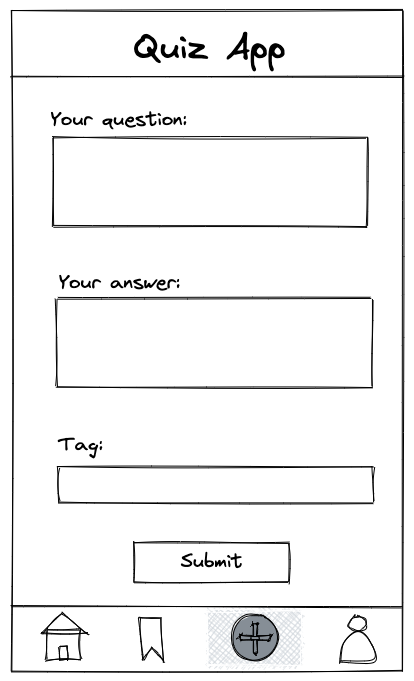
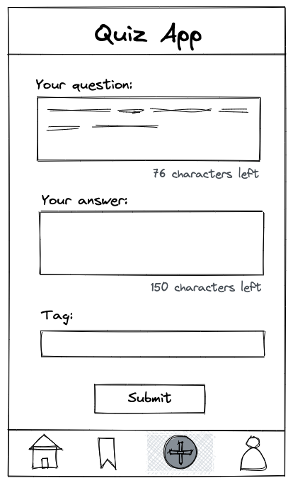

# Recap Projekt 2: Quiz App – Interaktivität

In einem früheren Projekt hast du das Layout für eine Quiz App mit HTML und CSS erstellt. Der Fokus dieses Projekts liegt darauf, mit JavaScript **Interaktivität** hinzuzufügen.

## Überblick

Wir werden Interaktivität auf den **Home**- und **Bookmark**-Seiten hinzufügen, sodass Benutzer Karten **bookmarken** und die **Antwort zu einer Frage anzeigen oder verstecken** können. Außerdem erstellen wir eine neue Seite, **Add**, auf der Benutzer eigene Fragen mit Antworten und Hashtags einreichen können. Die neu erstellten Fragekarten werden auf der **Add-Seite** angezeigt.

Zusammengefasst wird dieses Projekt die folgenden vier Seiten umfassen:

- **Home-Seite:** Benutzer können alle auf der Plattform verfügbaren Fragen ansehen.
- **Bookmark-Seite:** Ein eigener Bereich zum Anzeigen der gemerkten Fragen, ähnlich denen, die auf der Startseite markiert wurden.
- **Add-Seite:** Eine Seite, auf der Benutzer neue Fragen erstellen können, indem sie Frage, Antwort und Hashtag eingeben.
- **Profil-Seite:** Diese Seite ermöglicht es dem Benutzer, das eigene Profil und die Einstellungen anzuzeigen und zu verwalten.

## Template

Wenn du dein Projekt aus Recap Projekt 1 noch nicht abgeschlossen hast oder nicht zufrieden bist, kannst du dieses Template verwenden, um deine Arbeit fortzusetzen.

Öffne dein Terminal und navigiere zu dem Ordner, in dem sich alle deine Projekte befinden. Führe anschließend den folgenden Befehl aus, um ein neues Projekt basierend auf dem Template zu erstellen:

```bash
npx ghcd@latest wd-bootcamp/web-exercises/tree/main/sessions/recap-project-2/quiz-app -i
```

Alternativ kannst du weiterhin mit der Quiz App aus Recap Projekt 1 arbeiten.

### Template-Überblick

- Es gibt drei Seiten:
    - eine `index.html` mit einer Liste aller Fragekarten
    - eine `bookmark.html` mit nur den gemerkten Karten
    - eine `profile.html` mit persönlichen Informationen und Einstellungen
- Die Struktur des Stylings folgt [BEM](http://getbem.com/introduction/); daher sind die CSS-Dateien nach den jeweiligen Komponenten organisiert.

## Ressourcen

Lade die benötigten [Icons](https://lucide.dev/icons/) herunter und speichere sie in einem Ordner namens „assets“ im Hauptverzeichnis deiner App.

## Deployment deines Projekts

Wenn du das Template verwendest, musst du dein Projekt **deployen**.

🚀 **Das Deployment zu GitHub Pages ist erforderlich:** Bitte halte dich an die in der Dokumentation deines Repositorys beschriebenen Anweisungen (`docs/deployment-github-pages.md`), um genaue Schritte zu finden.

## Aufgaben

### 1. Toggle-Funktionalität

Du hast erfolgreich deine **Kartenkomponente** in deiner Quiz App erstellt. Derzeit kann der Benutzer jedoch **nicht** mit ihr interagieren. Nun wollen wir eine **Toggle-Funktion** für das **Bookmark** und den **Antwort-Button** implementieren.

> ❗️ Alle Funktionen gelten nur für die **erste Karte** und das **erste Lesezeichen**.  
> Wie man die Funktionalität auf alle Karten und Lesezeichen erweitert, wird später im Bootcamp behandelt.

#### Bookmark-Button

Die folgenden Akzeptanzkriterien sollten für den Bookmark-Button erfüllt sein:

- Wenn der Benutzer auf das **Lesezeichen-Symbol** klickt, sollte sich das **Aussehen des Symbols** ändern (z. B. Farbe oder Bild).
- Wenn der Benutzer erneut auf das Symbol klickt, sollte es in seinen ursprünglichen Zustand zurückkehren.
- Das Symbol kann endlos angeklickt werden und wird dabei zwischen beiden Zuständen **wechseln (toggeln)**.

> **Hinweis:** Das Klicken auf das Bookmark-Symbol führt **noch nicht** dazu, dass die Frage auf der **Favorites-Seite** angezeigt wird. Dies gehört **nicht** zu dieser Übung.

#### Antwort-Button

Die folgenden Akzeptanzkriterien sollten für den Antwort-Button erfüllt sein:

- Wenn der Benutzer auf den **Button** klickt, sollte die **zuvor verborgene Antwort** angezeigt werden.
- Wenn er erneut darauf klickt, wird die Antwort **wieder versteckt**.
- Der Benutzer kann beliebig oft klicken, und die Antwort wird entsprechend **ein- oder ausgeblendet**.
- Das **Toggle-Verhalten** sollte mithilfe einer **Klasse** umgesetzt werden, die **„hidden“** heißt.
  > Wenn du das Template verwendet hast, existiert dort bereits eine Klasse `card__answer--active`, die du verwenden kannst.
- Wenn der Benutzer auf den Button klickt, sollte der Text des Buttons **„hide answer“** anzeigen, wenn die Antwort sichtbar ist, und **„show answer“**, wenn sie ausgeblendet ist.

### 2. Formular zum Hinzufügen neuer Karten

Benutzer sollten in der Lage sein, neue Karten zu deiner Quiz App hinzuzufügen. Der erste Schritt ist, eine Seite mit einem Formular zu erstellen.



- Erstelle ein neues HTML-Dokument mit dem Namen `form.html`.
- Füge die Seite der Navigation deiner Quiz App hinzu.
- Erstelle in `form.html` ein Formular mit folgenden Feldern:
    - „Your question“ als `<textarea />`
    - „Your answer“ als `<textarea />`
    - „Tag“ als `<input type="text" />`
    - **Submit-Button**

> ❗️ Berücksichtige zunächst nur **einen einzelnen Tag** pro Karte.  
> Die Handhabung mehrerer einzelner Tags wird später im Kurs besprochen.

### 3. Neue Karten erstellen

Die im Formular eingegebenen Daten sollten verwendet werden, um eine neue Fragekarte zu erstellen, die wie die bisherigen Fragen angezeigt wird.

- Lausche auf das `submit`-Event des Formulars.
- Verhindere das Standardverhalten (Seiten-Reload) mithilfe von `event.preventDefault()`.
- Lies alle eingegebenen Daten aus den Formularfeldern (Frage, Antwort, Tag).
- Erstelle alle erforderlichen DOM-Elemente für eine Karte per `createElement()`.
- Füge die Formulardaten als Text in die DOM-Elemente ein.
- Hänge die erstellte Karte direkt **unterhalb des Formulars** an.

> ❗️ Für den Moment sollte die neue Karte nur direkt unter dem Formular angezeigt werden.  
> Das Hinzufügen zur Hauptliste der Karten wird später behandelt.

> **Hinweis:** Um Fehlermeldungen zu vermeiden, wird empfohlen, eine **eigene JavaScript-Datei** speziell für die Formularseite zu erstellen. Das stellt sicher, dass Event Listener für andere Seiten keine Fehler verursachen, falls dort HTML-Elemente fehlen.

### 4. Zeichenanzahl im Formularfeld

Die Formularfelder für Frage und Antwort sollten auf **150 Zeichen** begrenzt sein. Während der Eingabe soll der Benutzer Informationen über die verbleibende Zeichenanzahl erhalten.




- Füge das Attribut `maxlength` zu den Formularfeldern hinzu.
- Füge unterhalb der Felder eine Anzeige hinzu, die die verbleibende Zeichenzahl anzeigt.
- Verwende das `input`-Event, um die Länge des Inhalts zu lesen und das Ergebnis anzuzeigen.
- Überlege dir, wie du dieselbe Logik für **beide Formularfelder** nutzen kannst, um Code-Duplikate zu vermeiden.

## Bonus

1. Wenn du beim Hinzufügen einer neuen Fragekarte auf deiner `form.html`-Seite bist, füge auch Event Listener zu dem neuen Button und Icon hinzu, die dieselbe Funktionalität wie in **Aufgabe 1** besitzen.

   > ❗️ Du brauchst hierfür keine Schleifen oder `querySelectorAll`.  
   > Versuche, den jeweiligen Button und das Icon **direkt nach dem Hinzufügen zum DOM** mit eindeutigen Attributen zu erfassen.

2. Füge auf der Profil-Seite einen Event Listener zu deinem **Dark-Mode-Schalter** hinzu, der zwischen einer dunklen und einer hellen Version der Profilseite umschaltet.

   > ❗️ Dafür musst du einige **CSS-Variablen** als Attribute im `<body>`-Element definieren.

   > ❗️ Diese Funktion sollte **nur auf der Profilseite** funktionieren.  
   > Später im Kurs wirst du lernen, wie man den Dark-/Light-Mode auf die gesamte Anwendung überträgt.

   

# Recap Project 2: Quiz App - Interactivity

In a previous project, you created the layout for a Quiz App using HTML and CSS. The focus of this project is to add interactivity with JavaScript.

## Overview

We will add interactivity to the **Home** and **Bookmark** pages, allowing users to bookmark a card and show or hide the answer to a question. Additionally, we will create a new page, **Add**, where users can submit their own questions with answers and hashtags. These newly created question cards will be displayed on the **Add** page.

In summary, this project will include the following four pages:

- **Home page:** Users can view all questions available on the platform.
- **Bookmark page:** A dedicated space to view bookmarked questions, similar to the ones marked on the home page.
- **Add page:** A page for users to create new questions by submitting a question, answer, and hashtag.
- **Profile page:** This section allows users to view and manage their profile and settings.

## Template

If you are not yet finished or not satisfied with your code from Recap Project 1, you can use this template to start your
work.

Open your terminal and navigate to the folder where all your projects are located. Execute the following
command to create a new project based on a template:

```bash
npx ghcd@latest wd-bootcamp/web-exercises/tree/main/sessions/recap-project-2/quiz-app -i
```

Alternatively, you can keep working with the Quiz App you built in Recap Project 1.

### Template Overview

- There are three pages:
    - an `index.html` with a list of all question cards
    - a `bookmark.html` with bookmarked cards only
    - a `profile.html` with personal information and settings
- The structure of styling follows [BEM](http://getbem.com/introduction/); this is why the CSS files
  are organized according to their corresponding component.

## Resources

Download the required [Icons](https://lucide.dev/icons/) and save them in an "assets" folder within your app's main directory.

## Deploying Your Project

If you are using the template, you will need to deploy you project.

🚀 Project Deployment to GitHub Pages is required: Please adhere to the deployment guidelines outlined in your repository's documentation (`docs/deployment-github-pages.md`) for detailed instructions.

## Tasks

### 1. Toggle functionality

You have successfully built your **card** component in your Quiz App. But currently the user
**can't** interact with it. Now we want to implement a toggle functionality for the bookmark and the
answer button.

> ❗️ All functionality applies to the **first card** and the **first bookmark** only. Applying the
> functionality to all cards and bookmarks will be discussed later in the bootcamp.

#### Bookmark button

The following acceptance criteria should be met for the bookmark button:

- When the user clicks the **bookmark icon** the **bookmark icon** should change it's visual state
  (e. g. another color or image)
- When the user clicks the **bookmark icon** again the **bookmark icon** should change to its former
  style
- The user can click on the bookmark endlessly and the bookmark will **toggle between both
  stylings**

> **Note:** Clicking on a bookmark icon will not yet cause the question to be displayed on the
> **favorites** page as well and this is **not** part of the exercise.

#### Answer button

The following acceptance criteria should be met for the answer button:

- When the user clicks on the **button** the **previously hidden** answer should be displayed
- When the user clicks this **button** again the answer is **hidden** again
- The user can click on this button endlessly and the answer will **either be displayed or hidden**
  after each click
- The **toggle** functionality should be applied by using a **class** which is named **"hidden"**
> If you used the template, there is a class `card__answer--active` you can work with
- If the user clicks on an answer button, we want the button to say **"hide answer"** when the
  answer is displayed and **"show answer"** when the answer is not displayed.

### 2. Form to add new cards

Users should be able to add new cards to your Quiz App. The first step is to add a page with a form.


- Create a new HTML document called `form.html`
- Add the page to the navigation of your Quiz App
- Within `form.html` create a form with the following fields
    - "Your question" as `<textarea />`
    - "Your answer" as `<textarea />`
    - "Tag" as `<input type="text" />`
    - Submit button

> ❗️ Please consider only a single tag per card for now. Handling a list of individual tags will be
> discussed later on.

### 3. Create new Cards

The data entered into the form by users should be used to create a new question, that will be
displayed as a **card** like the other questions.

- Listen the form's `submit` event
- Prevent the default submit behavior to handle everything within JavaScript
- Read all entered data from the input fields (question, answer, tags)
- Generate all DOM element for a **card** with `createElement()`
- Insert the form's data as text into the DOM elements
- Append the **card** to the page, directly below the form

> ❗️ For now the new **card** should be displayed directly below the form. Adding the **card** to
> the list of the other cards is a topic for later.

> **Note:** To avoid error messages, we recommend creating a new JavaScript file specifically for your form page. This ensures that any event listeners you've added for other pages won't cause problems with HTML elements that aren't present on the form page.

### 4. Form field text counter

The form fields for question and answer should be limited to a text of 150 characters. While typing
users should be informed about the amount of characters left.


- Add a `maxlength` attribute to the form fields
- Add a display below the form fields to show the amount of characters
- Use the `input` event to read the `length` of a field's content and calculate and display the
  result
- Think of ways to use the same logic for both form fields and to not repeat your code

## Bonus

1. When adding a new question card in your newly created `form.html`, also add event listeners to the new button and icon which will have the same functionality as described in Task 1.

   > ❗️ You DON'T need any loops or querySelectorAll. Just try to grab the individual button and icon directly after adding them to the DOM by giving them unique attributes.

2. Add an event listener to the dark mode toggle button in your profile page which should toggle on a dark or light version of the profile page.

   > ❗️ You'll need to set some CSS variables as attributes to the <body> element for example.

   > ❗️ This functionality should only work for the profile page. Later in the course we will have a look at how to implement dark/light mode on the whole application.